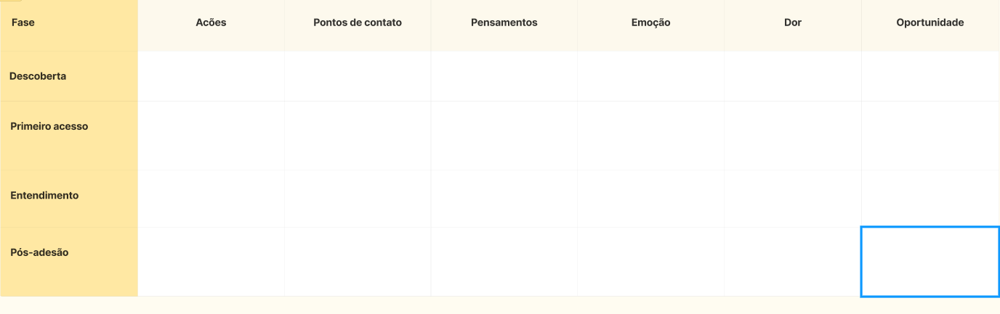

# Mapa de jornada do usuário

> Entregável da aula 19. Substitua os textos entre colchetes.

## Persona

- **Nome e idade:** [ ]
- **Contexto:** [como conheceu a Bulbe, como aderiu]
- **Objetivo:** [ ]
- **Medos e dúvidas:** [ ]
- **Canais que usa:** [ ]

## Mapa

| Fase | Ações | Pontos de contato | Pensamentos | Emoção | Dor (com evidência da Bulbe) | Oportunidade |
| --- | --- | --- | --- | --- | --- | --- |
| [ ] | [ ] | [ ] | [ ] | [ ] | [ ] | [ ] |

## Oportunidades registradas como Issues

- [ ] #[número] [título da oportunidade]
